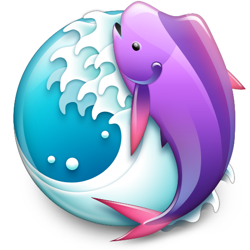
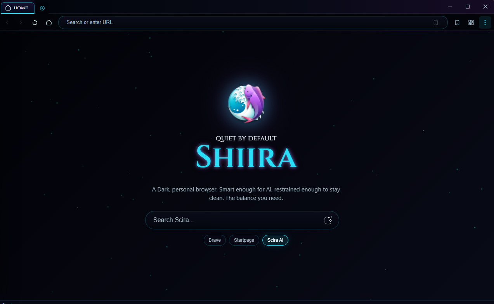

<p align="center">
  
</p>

<p align="center">
  
</p>

# Shiira Browser 

Shiira is an Electron-based desktop browser inspired by the classic Shiira browser for Mac OS X. It combines a dark custom interface with practical browser features such as tab management, bookmarks, history, ad blocking, session restore, password storage, and an assistant sidebar. It is meant to function as a backup secondary browser.

The project is a modern homage rather than a port. It does not depend on original Shiira source code; the design direction is based on public descriptions of the original browser and its interface ideas.

## Highlights

- Dark custom browser chrome with the Shiira Night theme
- Tabbed browsing with drag support, audio mute indicators, and lazy session restore
- Full-window Tab Expose view for switching between open tabs
- Drawer-style panels for bookmarks, history, cache controls, and RSS
- Bookmarks bar, favorites launcher, and Chrome bookmark import
- Search from the home view with Google, DuckDuckGo, Brave, and Wikipedia
- Native ad blocking with network and cosmetic filtering
- Password manager with secure storage and CSV import
- Cache, cookie, and site storage cleanup tools
- Optional clear-on-exit cache behavior
- Built-in update checks

## Shiira-Inspired Features

| Feature | Current status |
| --- | --- |
| Tabbed windows | Implemented |
| Bookmark management | Implemented |
| Side drawer for bookmarks and history | Implemented as Shiira palettes |
| Bookmarks toolbar | Implemented |
| Search field with selectable search engine | Implemented |
| Cache control panel | Implemented in the Cache palette |
| Remove cookies and cache at termination | Implemented as a Cache palette toggle |
| Window appearance switching | Implemented as themes |
| Favicons | Implemented |
| Searchable history | Implemented |
| Safari bookmark sharing | Not implemented; Chrome import is available |
| Toolbar customization and toolbar icon switching | Not implemented |
| Favicon list and per-bookmark favicon toggle | Not implemented |
| Help document | Not implemented |
| Multiple source windows and HTTP header source view | Not implemented |
| Wheel-button tab operations | Not implemented |
| Auto-tab for bookmark folders | Not implemented |
| Back/forward list on toolbar buttons | Not implemented |

## Keyboard Shortcuts

| Shortcut | Action |
| --- | --- |
| `Ctrl+T` | New tab |
| `Ctrl+W` | Close tab |
| `Ctrl+Shift+T` | Reopen closed tab |
| `Ctrl+Tab` | Next tab |
| `Ctrl+Shift+Tab` | Previous tab |
| `Ctrl+L` | Focus URL bar |
| `Ctrl+R` / `F5` | Reload |
| `Ctrl+Shift+R` | Hard reload |
| `Alt+Left` | Back |
| `Alt+Right` | Forward |
| `Ctrl+H` | History |
| `Ctrl+Shift+B` | Toggle bookmarks bar |
| `Ctrl+Shift+E` | Tab Expose |
| `Ctrl+Shift+I` | Developer tools |
| `Escape` | Close popups and panels |

## Development

Install dependencies:

```bash
npm install
```

Run the app in development mode:

```bash
npm run dev
```

## Build

Create a production build:

```bash
npm run build
```

Platform-specific builds are also available:

```bash
npm run build:win
npm run build:mac
npm run build:linux
```

Build artifacts are written to `dist/`.

## Project Structure

```text
src/main/                 Main Electron process and services
src/preload/              Secure IPC bridge
src/renderer/             Browser UI
src/renderer/modules/     Browser feature modules
assets/                   App artwork, UI icons, and site logos
filter-lists/             Ad-blocking rules
build/                    Build hooks and installer assets
installer/                Installer UI
```

## License

Shiira Browser is licensed under **GPL-3.0-only**.

The original Shiira project was released under **BSD-3-Clause**. This project is an independent Electron implementation and homage, with no original Shiira source code included.

For copyright attributions, project background, and dependency licensing details, see [credits.md](credits.md).
